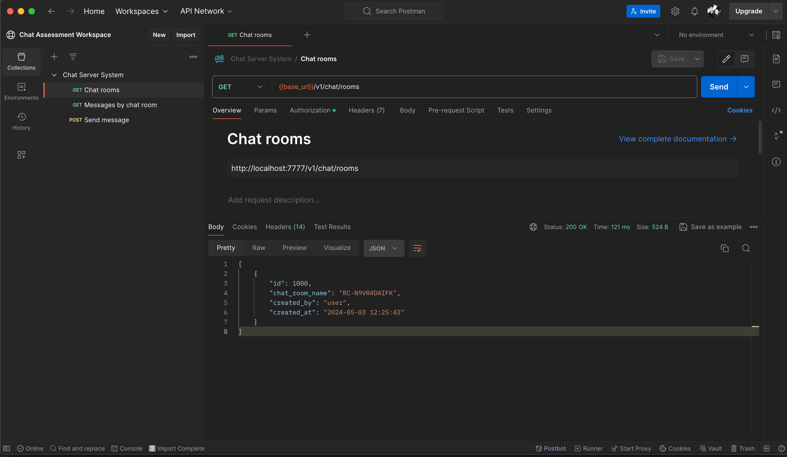
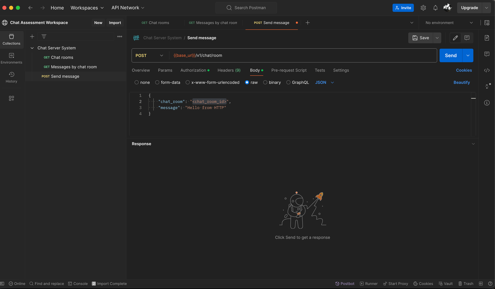
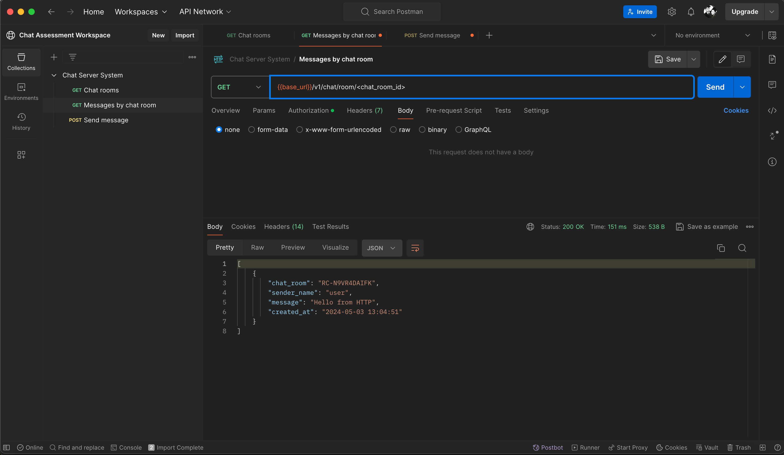

# Chat Server System

## Table of Contents

- [Overview](#overview)
- [Technology Used](#technology-used)
- [Installation](#installation)
- [Code Coverage](#code-coverage)
- [Contributing](#contributing)
- [License](#license)

***

## Overview

A Java-based chat server service system that enables users to join chat rooms, send messages and access chat history.  

There are 2 versions of application made by the developer. The following versions are:
1. RESTful endpoints
2. Websocket (for enhancement)

## Features

- [x] User authentication with basic username/password (User credentials not connected on Websocket)
- [x] Creation of single chat room upon server startup (Creation upon fetching of chatroom list)
- [x] Storage of chat message in database
- [x] Sending and receiving messages in the chat room (Accessing chat room history is only available on RESTful endpoint)
- [x] Unit testing

## Technology Used

This project was built using the following technologies:

- [Java 17](https://www.oracle.com/java/technologies/downloads/)
- [Spring Boot](http://projects.spring.io/spring-boot/)
- [Maven](https://maven.apache.org/)
- [PostgreSQL](https://www.postgresql.org/)

## Installation

Make sure you have Java, Maven and PostgresSQL installed on your machine. You must follow the following steps in order to properly setup the application:

### I. Database Setup
1. Create user role 
   ```
    CREATE ROLE admin WITH
    LOGIN
    SUPERUSER
    CREATEDB
    CREATEROLE
    INHERIT
    NOREPLICATION
    CONNECTION LIMIT -1
    PASSWORD 'admin';
   ```

   
2. Create database
   ```
    CREATE DATABASE chatdb
    WITH
    OWNER = admin
    ENCODING = 'UTF8'
    CONNECTION LIMIT = -1
    IS_TEMPLATE = False;
    ```

### II. Application Setup

1. Clone the repository:

    ```sh
    git clone https://github.com/lolalaladegs/chat-system.git
    ```

2. Navigate into the project directory:

    ```sh
    cd chat_system
    ```

3. Install the necessary dependency:

    ```sh
    mvn clean install
    ```

## Usage

1. Run the application:

    ```sh
    mvn spring-boot:run
    ```
   
### Testing of RESTful Endpoint

Make sure to import the following Postman Collections available on resources folder: [Postman Collection](src/main/resources/postman)

1. Before sending message, make sure to check for the chat room available. Use the GET Chat rooms endpoint to get chat room details.
     
2. For sending message, use the POST Send message endpoint and use the chat room id from chat room details and put it on chat_room field under request body:
   
3. For retrieving chat room messages, use the GET Messages by chat room endpoint and put the chat room id on the path variable :
   

### Testing of Websocket

Before checking websocket, make sure to check GET chatroom for chatroom creation.
1. Go to http://localhost:7777/ and use the following credentials below to enter the page:
   ```
   Username: user or admin
   Password: password
   ```
2. Add the name you wanted to use on the group chat and click enter.
   
3. For sending message, put your message on the message field and click enter.
   

** Fetching of chat history is only available on RESTful endpoint

## Code Coverage & Unit Test

This project has achieved a code coverage of 96% excluding configuration files.

For detailed coverage reports, do the following:

1. Generate code coverage report:

    ```sh
    mvn clean test
    ```

2. View the coverage report located at target/site/jacoco/index.html:

- [Coverage Report](target/site/jacoco/index.html)

## Contributing

Contributions are welcome! Please follow these steps:

1. Fork the repository
2. Create your feature branch: `git checkout -b feature/YourFeature`
3. Commit your changes: `git commit -am 'Add some feature'`
4. Push to the branch: `git push origin feature/YourFeature`
5. Submit a pull request

## License

This project is licensed under the [MIT License](LICENSE).

## Future Improvements

- [ ] User credentials connected on Websocket 
- [ ] Fetching of message through Websocket
- [ ] Connecting user authentication on database
- [ ] Adding of request validations for security
